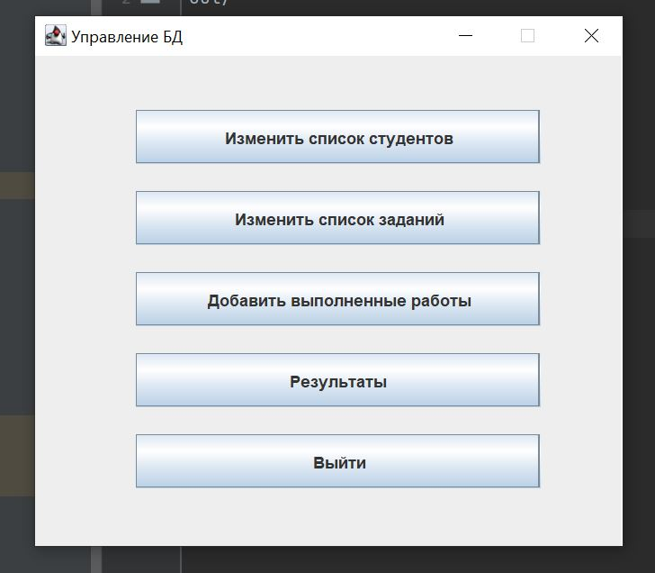

# PlagiarismDetectionApp
This application is designed to check the source code of students for plagiarism.
Student works can be uploaded to the embedded database H2 and then processed. 
The application outputs a report in the form of an Excel table.  

The application menu:  
  

A sample report:  
 
 
